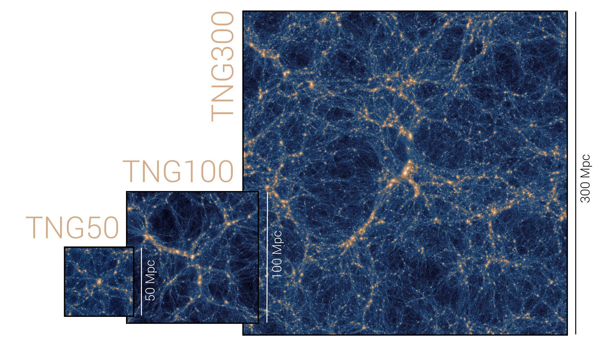

pyTNG
=====

``PyTNG`` is a light-weight python library for interacting with the `Illustris / IllustrisTNG<https://www.tng-project.org/>` simulation suites. ``pyTNG`` is designed to simplify API interaction and provide
easy transfer of data from the Illustris API to python and then to ``yt`` datasets for further analysis. Using ``pyTNG``, you can easily manage large queries to the API, sequential downloading, and data visualization.

Pages
=====

.. toctree::
   :maxdepth: 1

   api
